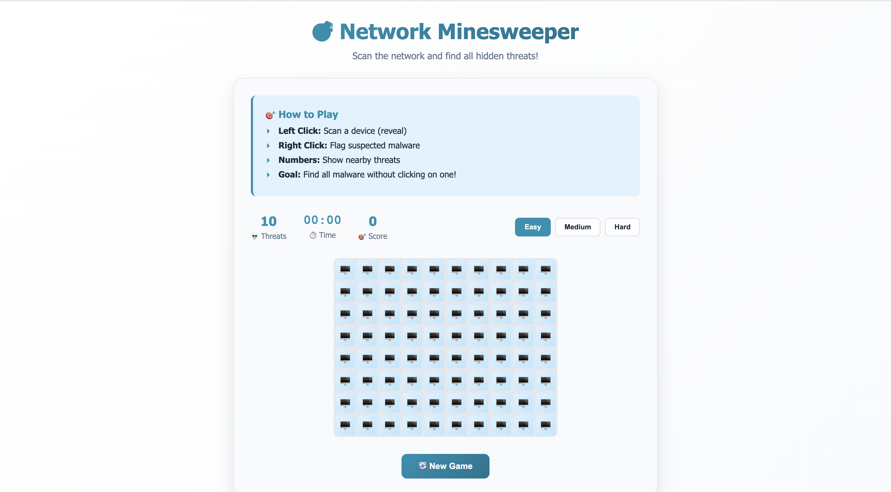

# 💣 Network Minesweeper

An educational cybersecurity twist on the classic Minesweeper game! Scan a network for hidden malware and threats.

## 🎮 [Play Live Demo](https://theghostpacket.github.io/network-minesweeper/)

## 🎯 Features

- 🔍 Three difficulty levels (Easy, Medium, Hard)
- 💀 Find hidden network threats
- 🚩 Flag suspicious devices
- ⏱️ Timer and scoring system
- 🎯 High score tracking
- 📱 Mobile responsive

## 🕹️ How to Play

- **Left Click**: Scan a device (reveal)
- **Right Click**: Flag suspected malware
- **Numbers**: Show how many threats are nearby
- **Goal**: Find all malware without clicking on one!

## 🛠️ Built With

- Pure HTML5, CSS3, JavaScript
- No external dependencies
- Responsive design

## 🎓 Educational Value

Demonstrates:
- Grid-based algorithms
- Recursive flood fill
- Game logic and state management
- Cybersecurity concepts (network scanning, threat detection)

## 📄 License

MIT License - feel free to use for learning!

---

**Made with ❤️ by TheGhostPacket**